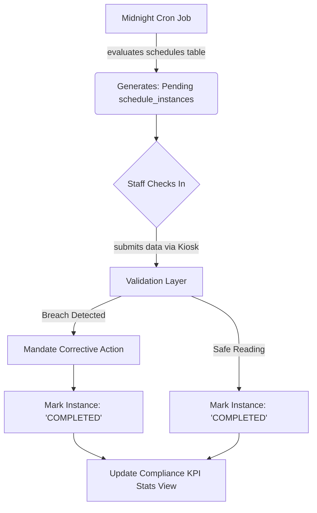
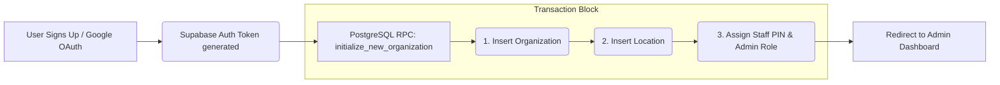
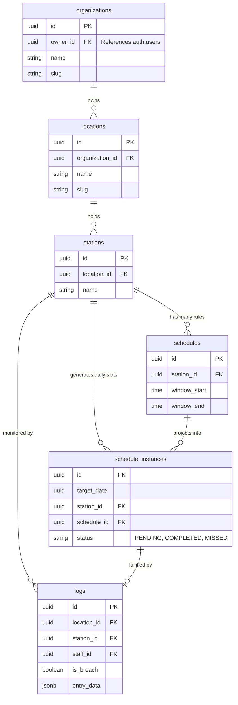

# AuditShield: Comprehensive Architecture & Data Flow Map

  

AuditShield has evolved from a simple logging utility into a multi-tenant Compliance Operating System. This document maps the interconnected systems, data flows, and infrastructure pillars that drive the platform.

  

---

  

## 1. System Layers

  

### Identity Layer

- **Core Auth**: Supabase Authentication handles all standard credential management securely enforcing session JWTs.

- **OAuth Expansion**: Integrated Google OAuth bridging into `/auth/callback` to eliminate ghost users and guarantee complete `.org` provisioning.

- **Physical Verification**: Localized Kiosk authentication powered by Staff PIN validation (`staff.pin_code`), preventing unverified compliance submissions on shared hardware.

  

### Logic Layer

- **The "Schedule Engine"**: Administrators configure recursive time windows (`schedules` table) for when operations must legally log food safety operations.

- **Slot Generation**: Based on the `schedules` matrix, dynamic daily compliance goals (`schedule_instances`) are spawned via our database cron-logic automatically projecting pending intervals.

  

### Validation Layer

- **Breach Detection**: Native client-side state validators inherently detect out-of-band values (e.g. Temp > 40°F).

- **Mandatory Corrective Action**: If a trigger evaluates to `IsBreach = true`, the application aggressively mandates a non-nullable corrective step before the `log` is successfully injected.

- **Transaction Atomicity**: Heavy initialization pipelines (such as Onboarding) use dedicated `BEGIN...COMMIT` PostgreSQL RPC chains blocking partial-state artifacts.

  

### Reporting Layer

- **Compliance Stats View**: Real-time aggregation components calculating precise `PENDING`, `SAFE`, and `MISSED` key performance indicators (KPIs) mapped instantly from the `schedule_instances` state.

- **PDF Export Engine**: Utilizing `jsPDF` and `jspdf-autotable` directly inside the browser DOM allowing users to download `filtered` tables matching on-screen UI exactly, highlighting `<Breach>` operations seamlessly.

  

---

  

## 2. Data Flow Models

  

### The "Log Life Cycle"

The engine coordinates the daily rhythm by marrying theoretical planning with physical logging.

  

### The "Onboarding Lifecycle"

A strictly enforced `RPC` funnel guaranteeing clean provisioning of business workspaces.

  

---

  

## 3. Database Schema Visualization

  

Here is the fundamental Relational Database architecture backing the logic block.

  

  

> [!NOTE]

> `food_safety_logs` are internally mapped to the `logs` table in schema. Notice the JSONB `entry_data` column allowing highly flexible schemaless metrics (such as temp vs humidity) per station constraint.

  

---

  

## 4. Infrastructure Stack

  

This system binds four critical best-in-class components to create a massive scaling footprint:

  

1. **Next.js (App Router)**  

   *The Client Environment.* It hosts the entirety of our localized React state (`useState`, `useMemo`), renders the operational UI, enforces dynamic `offset` pagination, and generates our embedded `jsPDF` documentation natively saving Lambda costs.

  

2. **Supabase (PostgreSQL Platform)**  

   *The Core Brain.* Responsible for hosting our strict Relational DB, parsing Google OAuth parameters instantly (`auth.users`), running scheduled PG-Cron functions dynamically mapping out daily slots, and executing atomic `.rpc()` stored procedures cleanly safely securing multi-system `inserts`.

  

3. **Vercel**  

   *The Hosting Backbone.* Edge-deployed static and dynamic routing handling raw SSL, networking protocols, cache-headers, and continuous deployment workflows directly from the Git framework guaranteeing `99.99%` uptime connectivity globally.

  

4. **Resend (SMTP)**  

   *The Comm Provider.* The API bound emailing engine allowing system-level triggers (such as `Critical Alerts` or weekly summaries) to bypass spam-filters and land smoothly directly into managers' inboxes via heavily styled React-Email templates.